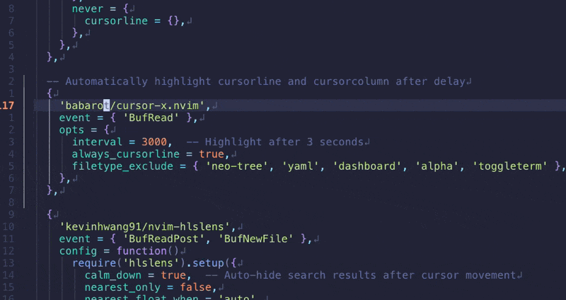

# cursor-x.nvim

<!--  -->


Automatically highlight cursorline and cursorcolumn when the cursor stops moving

## Features

- **Smart Highlighting**: Automatically shows cursor position after a configurable delay
- **Non-intrusive**: Only highlights when you need it - hides during active editing
- **Customizable**: Configure delay time, highlight groups, and exclusion rules
- **Performance-focused**: Efficient timer-based implementation using vim.loop
- **Well-documented**: Complete LuaLS type annotations and Vim help documentation

## Installation

### [lazy.nvim](https://github.com/folke/lazy.nvim)

```lua
{
  'babarot/cursor-x.nvim',
  event = { 'BufReadPost', 'BufNewFile' },
  config = function()
    require('cursor-x').setup()
  end,
}
```

### [packer.nvim](https://github.com/wbthomason/packer.nvim)

```lua
use {
  'babarot/cursor-x.nvim',
  config = function()
    require('cursor-x').setup()
  end,
}
```

### [vim-plug](https://github.com/junegunn/vim-plug)

```vim
Plug 'babarot/cursor-x.nvim'
```

Then in your `init.lua`:
```lua
require('cursor-x').setup()
```

## Configuration

### Default Settings

```lua
require('cursor-x').setup({
  interval = 1000,                      -- Delay in milliseconds (default: 1000)
  always_cursorline = false,            -- Always show cursorline (default: false)
  filetype_exclude = {},                -- Filetypes to exclude (default: {})
  buftype_exclude = {},                 -- Buffer types to exclude (default: {})
  highlight_cursor_line = 'Visual',     -- Highlight group for cursor line (default: 'Visual')
  highlight_cursor_column = 'Visual',   -- Highlight group for cursor column (default: 'Visual')
})
```

### Configuration Examples

#### Basic Usage

```lua
require('cursor-x').setup({
  interval = 3000, -- Show highlight after 3 seconds of inactivity
})
```

#### Exclude File Types

Useful for file explorers, terminals, and other special buffers:

```lua
require('cursor-x').setup({
  filetype_exclude = {
    'neo-tree',
    'NvimTree',
    'TelescopePrompt',
    'alpha',
    'dashboard',
  },
  buftype_exclude = {
    'terminal',
    'nofile',
  },
})
```

#### Custom Highlight Groups

Use your own highlight groups for better integration with your colorscheme:

```lua
require('cursor-x').setup({
  highlight_cursor_line = 'CursorLine',
  highlight_cursor_column = 'CursorColumn',
})
```

#### Keep Cursorline Always Visible

If you want the cursorline to stay visible even while typing:

```lua
require('cursor-x').setup({
  always_cursorline = true,
  -- Or inherit from your current setting:
  -- always_cursorline = vim.opt.cursorline:get(),
})
```

## Usage

### Lua API

```lua
-- Enable highlighting globally
require('cursor-x').enable()

-- Disable highlighting globally
require('cursor-x').disable()
```

### Vim Commands

```vim
:CursorXEnable    " Enable cursor highlighting
:CursorXDisable   " Disable cursor highlighting
```

### Keybindings (Optional)

Add these to your configuration if you want quick toggle:

```lua
vim.keymap.set('n', '<leader>ce', '<cmd>CursorXEnable<cr>', { desc = 'Enable cursor highlight' })
vim.keymap.set('n', '<leader>cd', '<cmd>CursorXDisable<cr>', { desc = 'Disable cursor highlight' })
```

## How It Works

cursor-x.nvim uses a smart timer-based approach:

1. **Cursor moves**: The highlight is immediately hidden
2. **Timer starts**: Begins counting the configured interval
3. **Cursor stops**: After the interval elapses, the highlight appears
4. **Visual feedback**: Cursorline and cursorcolumn are highlighted with your chosen style

This provides visual feedback when you need it without being distracting during active editing.

## Customization Tips

### Creating Custom Highlight Groups

Define your own highlight group for unique styling:

```lua
-- In your colorscheme or init.lua
vim.api.nvim_set_hl(0, 'CursorXHighlight', {
  bg = '#3d59a1',
  fg = '#ffffff',
  bold = true,
})

require('cursor-x').setup({
  highlight_cursor_line = 'CursorXHighlight',
  highlight_cursor_column = 'CursorXHighlight',
})
```

### Per-Project Configuration

Use autocmds to adjust settings based on your project:

```lua
require('cursor-x').setup({
  interval = 2000,
})

vim.api.nvim_create_autocmd('DirChanged', {
  pattern = '*',
  callback = function()
    -- Faster highlight in specific projects
    if vim.fn.getcwd():match('my%-fast%-project') then
      require('cursor-x').setup({ interval = 500 })
    end
  end,
})
```

## Help Documentation

For complete documentation, see:

```vim
:help cursor-x
```

## Contributing

Contributions are welcome! Please feel free to submit issues or pull requests.

## License

MIT

## Acknowledgments

Inspired by [auto-cursorline.nvim](https://github.com/delphinus/auto-cursorline.nvim)
